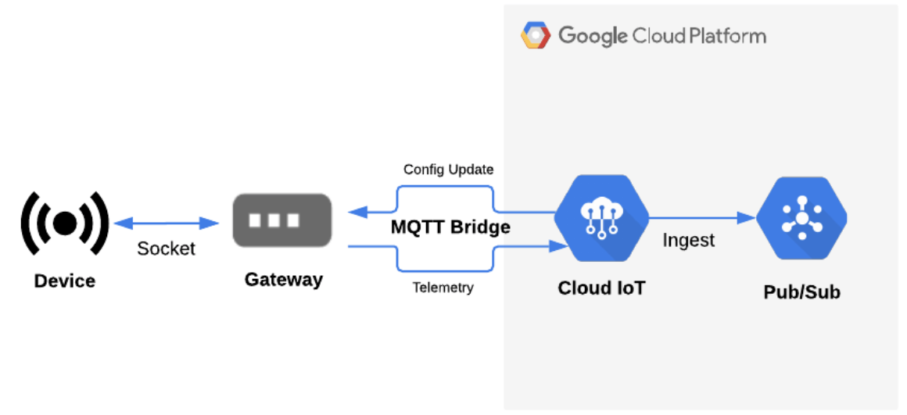
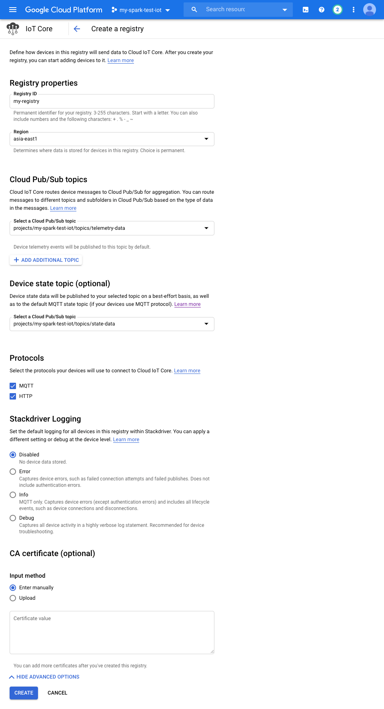
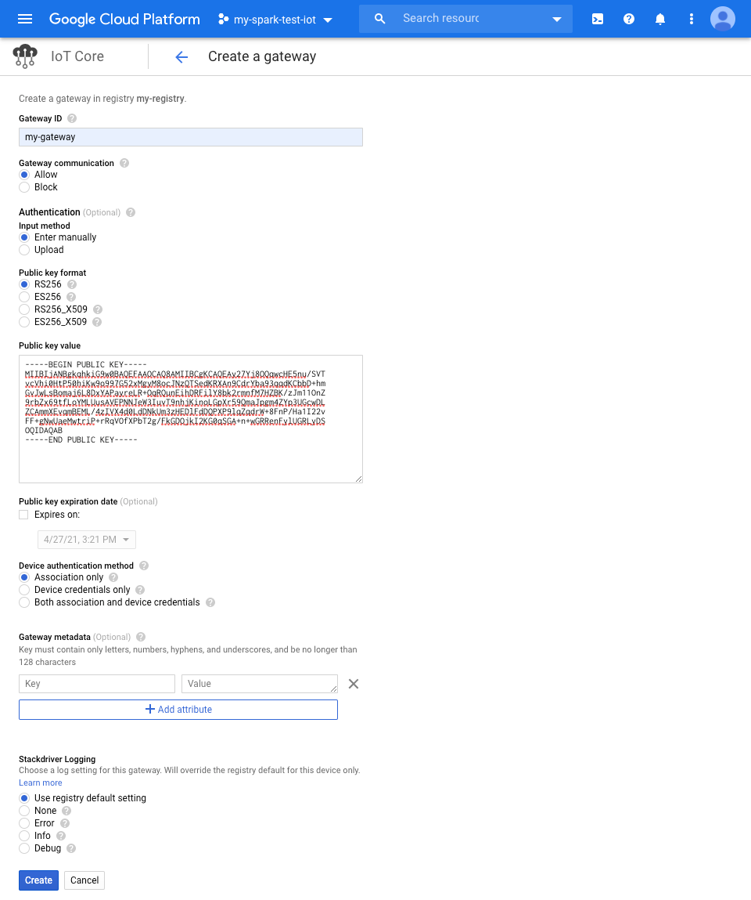
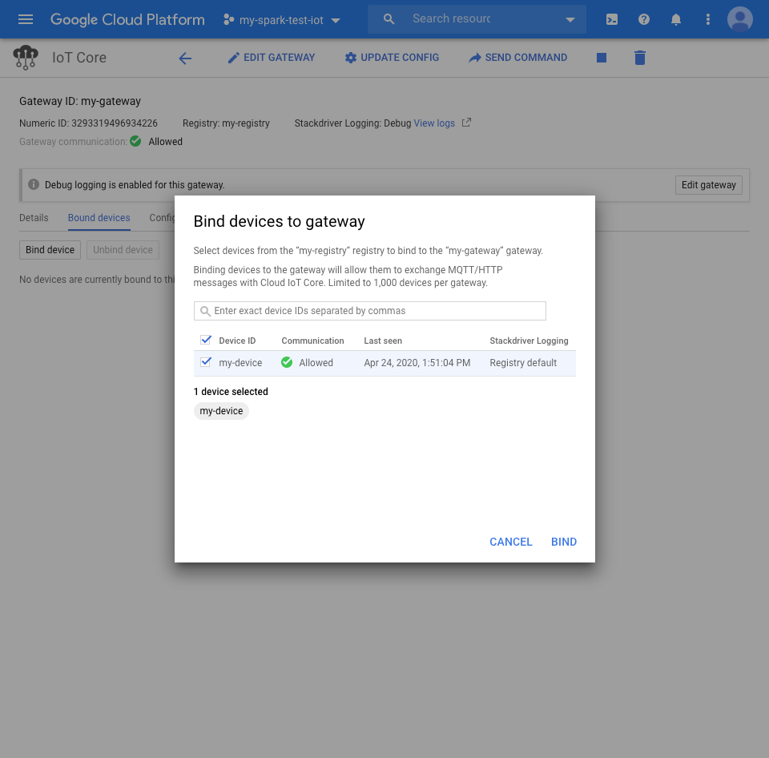

# Tutorial #1: Cloud IoT Core - Connectivity

This tutorial is inspired and adapted from this [article](https://cloud.google.com/community/tutorials/cloud-iot-gateways-rpi) - which is part of [Google Cloud Community Tutorial](https://cloud.google.com/community/tutorials/)

This tutorial shows you how to set up and use gateways on Cloud IoT Core. From the [documentation](https://cloud.google.com/iot/docs/how-tos/gateways), “a gateway is a device that connects less capable devices to Cloud IoT Core and performs several tasks on the device's behalf, such as communication, authentication, storage, and processing."

In this tutorial, you will create a gateway that manages a Raspberry Pi. Even though the device itself is capable of connecting to the Cloud IoT Core directly, we assume that it will connect itself through another gateway (a laptop in our setup), receive updates from and publish telemetry events to the cloud through the gateway.
<hr/>

## Architecture

The following diagram gives a high-level overview of how the device/gateway architecture is connected


<hr/>

## Objectives
- Setup components of Cloud IoT Core on Google Cloud Platform (GCP)
- Create a new gateway and bind a device to it
- Demonstrate changing configurations on a device bound to a gateway
- Demonstrate sending a command to a device bound to a gateway
- Demonstrate sending telemetry from a bound device to Cloud IoT Core
<hr/>

## Before you begin
This tutorial assumes you have a Google Cloud Platform (GCP) account and proper billing enabled. For quick cleanup, [create a new GCP project](https://www.techrepublic.com/article/how-to-create-your-first-project-on-google-cloud-platform/) to use just for this tutorial.

For more information about the different authentication methods Cloud IoT Core offers, see [Authenticating over the MQTT bridge](https://cloud.google.com/iot/docs/how-tos/gateways/authentication#authenticating_over_the_mqtt_bridge).
<hr/>

## Costs
This tutorial uses billable components of GCP, including:
- Cloud IoT Core
- Cloud Pub/Sub

This tutorial should not generate any usage that would not be covered by the free tier, but you can use the [pricing calculator](https://cloud.google.com/products/calculator) to generate a cost estimate based on your projected usage.
<hr/>

## Required hardware
- Laptop or desktop with git and python3
- [Raspberry Pi](https://www.raspberrypi.org/)
- [Sense HAT](https://www.raspberrypi.org/products/sense-hat/) (optional, just to display message via LED matrix)
- Local network connectivit between Raspberry Pi and Laptop/Desktop
- Internet connectivity between Laptop/Desktop to GCP
<hr/>

## Enable Cloud IoT Core and Cloud Pub/Sub APIs
If the corresponding API has not been activated for the GCP project. Click **Enable API** for each of the following:
- [Cloud IoT Core](https://console.developers.google.com/iot) (for managing gateways and devices)
- [Cloud Pub/Sub](http://console.developers.google.com/cloudpubsub) (for ingesting device telemetry)
<hr/>

## Create a registry
First, create a device registry that will contain your gateway and devices.

1. Open the [Cloud IoT Core console](https://console.developers.google.com/iot).

2. Ensure the right project is selected in the upper left.


3. Click on **Create a device registry**.

4. For **Registry ID**, enter <code><b>my-registry</b></code>.

5. Select the region closest to you, but for the purposes of this demo we'll use <code><b>asia-east1</b></code>.

6. Ensure the MQTT protocol is enabled for this registry.

7. Under **Cloud Pub/Sub topics**, create a new Cloud Pub/Sub topic for **Default telemetry topic**.

- Click on the **Select a Cloud Pub/Sub topic** dropdown.
- Click on the **Create a topic** option.
- Enter a Cloud Pub/Sub topic name, such as <code><b>telemetry-data</b></code>.

8. Do the same for **Device State** topic, under a different PubSub topic named <code><b>state-data</b></code>.


9. Leave everything else as-is, and click **Create**
<hr/>

## Set up your gateway
For the purposes of this tutorial, we are using a laptop or desktop as the gateway device for a simpler setup process.

You will first generate an RSA public/private key pair, which will be used to sign the JWTs for authenticating to Cloud IoT Core.

To set up your gateway:
1. Clone the following repository and change into the directory for this tutorial's code:
```bash
$ git clone https://github.com/kenly-ldk/gcp-iot-demo.git
$ cd connectivity/gateway
```

2. Generate an RS256 public/private key pair by running the following:
```bash
openssl genrsa -out gateway_rsa_private.pem 2048
openssl rsa -in gateway_rsa_private.pem -pubout -out gateway_rsa_public.pem
```
3. In the [Cloud IoT Core console](https://console.developers.google.com/iot), click on the registry you created.

4. Under the **Gateways** tab, click **Create Gateway**.

5. For **Gateway ID**, enter <code><b>my-gateway</b></code>.

6. Copy the contents of gateway\_rsa\_public.pem into the public key text area.

7. For **Device authentication method**, select **Association only**.


8. Leave everything else as-is, and click **Create**.

9. Download Google's CA root certificate into the same directory if it doesn't exist already.
```bash
wget https://pki.goog/roots.pem
```

10. Use a virtual environment to keep installations local to a workspace rather than installing libraries onto your system directly.
```bash
python3 -m venv .venv/gateway-venv
source .venv/gateway-venv/bin/activate
```

11. Modify the <code><b>run_gateway</b></code> script in this folder by changing the arguments for <code><b>registry_id</b></code>, <code><b>gateway_id</b></code>, <code><b>cloud_region</b></code>, <code><b>project_id</b></code> that match your own project deployment details.

12. Install the following Python packages by running the following command.
```bash
pip install -r requirements-gateway.txt
```

13. Run the following command to start the gateway:
```bash
source run_gateway
```

14. Keep this process running while you proceed through the next steps. We recommend that you use a new terminal window for the device setup.

15. Also find the local IP address of the gateway using ifconfig on MacOS/Linux or ipconfig /all on Windows. Copy this somewhere as you will need to add this IP address to <code><b>pi_device.py</b></code> later for connecting the device to the gateway.
<hr/>

## Device - Raspberry Pi setup
In this tutorial, you'll use a Raspberry Pi that is (optionally) equipped with a Sense Hat.

The device will connect to the gateway device through UDP sockets over a local network, and the gateway is connecting to Cloud IoT Core via the MQTT bridge. Again, the Raspberry Pi is not really a constrained device since it has IP connectivity and the ability to sign JWTs, so its usage here with the need to connect to the laptop/desktop gateway is mostly for demonstration purposes.

1. Login to the Raspberry Pi device via either SSH connection, or by attaching a physical keyboard and external display to the device.

2. Open a terminal and make sure git, python (python3), and other required dependencies are installed. If not, install them by running:
```bash
sudo apt update && sudo apt upgrade
sudo apt install git
sudo apt install python3
sudo apt install build-essential libssl-dev libffi-dev python3-dev
```

3. Clone the following repository and change into the directory for this tutorial's code:
```bash
git clone https://github.com/kenly-ldk/gcp-iot-demo.git
cd connectivity/device
```

4. Create and activate your virtual environment. Make sure to run the last step whenever you open a new tab to activate the virtual environment.
```bash
python3 -m venv .venv/device-venv
source .venv/device-venv/bin/activate
```

5. Install Python dependencies by running the following:
```bash
pip install -r requirements-device.txt
```
<hr/>

## Register the device
1. Switch to your browser and open the [Cloud IoT Core console](https://console.developers.google.com/iot).

2. Click on the registry you created. The gateway you created should be listed in this registry.

3. Click **Create Device**.

4. For **Device ID**, enter <code><b>my-device</b></code>.

5. Leave everything else blank or as-is. You don't need to enter a public key since the device will be authenticated through the gateway. Click **Create**

6. Next we bind the device to the gateway.
- Click on <code><b>my-gateway</b></code> from the **Gateways** tab in <code><b>my-registry</b></code>.
- Click on the **Bound devices** tab.
- Click **Bind device** and then select the box next to <code><b>my-device</b></code>.
- Confirm by clicking **Bind** in the lower right.

<hr/>

## Connect the device to the cloud, and manage it with Config / Command
1. Attach the Sense Hat to the Raspberry Pi device.

2. Ensure the gateway Python program is still running on your laptop/desktop terminal.

3. In the device terminal, edit <code><b>pi_device.py</b></code> by adding the IP address of your gateway on line 13 ADDR = ''.

4. Run the following from your terminal on the Raspberry Pi:
```bash
source run_device_v1
```

5. Make sure you see the log messages in the terminals of both the device and the gateway program. You will notice the sequence of device attaching itself to the gateway, as well as subscribing to the MQTT topics <code><b>/devices/my-device/config</b></code> and <code><b>/devices/my-device/commands/\#</b></code>
```bash		
# Expected log messages from gateway
2020-04-27 20:22:14,551 - INFO - From Address 192.168.86.31:50470 receive data: { "device" : "my-device", "action":"attach" }
2020-04-27 20:22:14,552 - INFO - [Attachment] Publishing to /devices/my-device/attach - payload {"authorization" : ""} - qos 1, with mid 3
2020-04-27 20:22:18,556 - INFO - From Address 192.168.86.31:50470 receive data: { "device" : "my-device", "action":"subscribe" }
2020-04-27 20:22:18,557 - INFO - [Subscription] Subscribing to /devices/my-device/config - qos 1, with mid 4
2020-04-27 20:22:18,557 - INFO - [Subscription] Subscribing to /devices/my-device/commands/# - qos 0, with mid 5
...
```
```bash
# Expected log messages from device
2020-04-27 21:33:07,878 - INFO - Bringing up device my-device
2020-04-27 21:33:07,878 - INFO - Send data: { "device" : "my-device", "action":"attach" } 
2020-04-27 21:33:11,751 - INFO - Send data: { "device" : "my-device", "action":"subscribe" } 
```

6. Now let’s update the configuration of the device. We switch back to a browser and go to the [Cloud IoT Core console](https://console.developers.google.com/iot).

7. Select your registry, and then select the device my-device.

8. Click **Update Config** at the top of the page.

9. In the configuration text area, enter <code><b>Configuration update message v2</b></code>, and click **Send To Device**.

10. From the program terminal, confirm that the gateway is receiving the configuration message, and is relaying it to the device.
```bash
# Expected log messages from gateway
2020-04-27 21:46:33,831 - INFO - Received message 'Configuration update message v2' on topic '/devices/my-device/config' with Qos 1
2020-04-27 21:46:33,831 - INFO - Relaying config[Configuration update message v2] to ('192.168.86.31', 42517)
```
```bash
# Expected log messages from device
2020-04-27 21:46:33,847 - INFO - Client received {Configuration update message v2}
```

11. Now let’s send a command to the device. We switch back to a browser and go to the Cloud IoT Core console >> device interface as mentioned in step 6 and 7.

12. Click **Send Command** at the top of the page.

13. In the command text area, enter <code><b>DISP: Hello World 123</b></code>, and click **Send Command**

14. We can confirm that the gateway is receiving the configuration message, and is relaying it to the device. Notice that there is a small <code><b>d_</b></code> prefix to the DISP message, this is intended as part of the logic implemented in the gateway.
```bash
# Expected log messages from gateway
2020-04-27 21:47:29,144 - INFO - Received message 'DISP: Hello World 123' on topic '/devices/my-device/commands' with Qos 0
2020-04-27 21:47:29,146 - INFO - Relaying config[d_DISP: Hello World 123] to ('192.168.86.31', 53849)
```
```bash
# Expected log messages from device
2020-04-27 21:47:29,165 - INFO - Client received {d_DISP: Hello World 123}
```

15. The device is programmed to receive this preconfigured message format (Starting with d\_DISP), and thus it will display the message Hello World 123 in the Sense Hat LED Matrix !!!
<hr/>

## Publishing device messages through the gateway
1. Stop the pi\_device.pyprogram from the device terminal by pressing **Control-C**

2. Run the program again, this time with _v2
```bash
source run_device_v2
```

3. If everything is done correctly, you should see there are 5 messages being sent from the device, one per second.
```bash
# Expected log messages from gateway
2020-04-27 20:22:14,551 - INFO - From Address 192.168.86.31:50470 receive data: { "device" : "my-device", "action":"attach" }
2020-04-27 20:22:14,552 - INFO - [Attachment] Publishing to /devices/my-device/attach - payload {"authorization" : ""} - qos 1, with mid 3
2020-04-27 20:22:18,556 - INFO - From Address 192.168.86.31:50470 receive data: { "device" : "my-device", "action":"subscribe" }
2020-04-27 20:22:18,557 - INFO - [Subscription] Subscribing to /devices/my-device/config - qos 1, with mid 4
2020-04-27 20:22:18,557 - INFO - [Subscription] Subscribing to /devices/my-device/commands/# - qos 0, with mid 5
2020-04-27 20:22:22,569 - INFO - From Address 192.168.86.31:50470 receive data: { "device" : "my-device", "action":"event", "data" : "Sending message #0" }
2020-04-27 20:22:22,570 - INFO - [Publishing Event] Publishing to /devices/my-device/events - payload "Sending message #0" - qos 0, with mid 6
2020-04-27 20:22:24,575 - INFO - From Address 192.168.86.31:50470 receive data: { "device" : "my-device", "action":"event", "data" : "Sending message #1" }
2020-04-27 20:22:24,575 - INFO - [Publishing Event] Publishing to /devices/my-device/events - payload "Sending message #1" - qos 0, with mid 7
2020-04-27 20:22:26,584 - INFO - From Address 192.168.86.31:50470 receive data: { "device" : "my-device", "action":"event", "data" : "Sending message #2" }
2020-04-27 20:22:26,585 - INFO - [Publishing Event] Publishing to /devices/my-device/events - payload "Sending message #2" - qos 0, with mid 8
...
```
```bash
# Expected log messages from device
2020-04-27 21:33:07,878 - INFO - Bringing up device my-device
2020-04-27 21:33:07,878 - INFO - Send data: { "device" : "my-device", "action":"attach" } 
2020-04-27 21:33:11,751 - INFO - Send data: { "device" : "my-device", "action":"subscribe" } 
2020-04-27 21:33:15,781 - INFO - Send data: { "device" : "my-device", "action":"event", "data" : "Sending message #0" } 
2020-04-27 21:33:17,786 - INFO - Send data: { "device" : "my-device", "action":"event", "data" : "Sending message #1" } 
2020-04-27 21:33:19,788 - INFO - Send data: { "device" : "my-device", "action":"event", "data" : "Sending message #2" } 
...
```
<hr/>	

## Create a subscription to your telemetry topic to view data
1. Open the [Cloud Pub/Sub console](https://console.cloud.google.com/cloudpubsub).

2. Click the three dot menu button next to the telemetry topic telemetry-data you created earlier, and click **Create subscription**.

3. Enter a subscription name, such as <code><b>my-subscription</b></code>.

4. Make sure **Delivery Type** is set to **Pull**, and leave everything else as-is.


5. Leave everything else as-is, and click **Create**.

6. Next, click the **Activate Cloud Shell** icon in the upper right area of the GCP window.


7. In the newly launched Cloud Shell terminal, enter the following:
```bash
gcloud pubsub subscriptions pull my-subscription --limit=10
```

8. The above is the command-line approach to consume messages from subscription. We can also view the messages directly from the GUI console, or more interestingly, by programming approach like below.

9. Within Cloud Shell terminal
```bash
git clone https://github.com/kenly-ldk/gcp-iot-demo.git
cd connectivity/pubsub
```

10. Create and activate your virtual environment.
```bash
python3 -m venv .venv/cloudshell-venv
source .venv/cloudshell-venv/bin/activate
```

11. Install Python dependencies by running the following:
```bash
pip install -r requirements-cloudshell.txt
```

12. Open the following program <code><b>pubsub_async_pull.py</b></code> in a shell editor (like vi), and edit the corresponding <code><b>project_id</b></code> and <code><b>subscription_name</b></code> in line 3 and 4 to match your own project deployment details.

13. Save the file, and then execute the program:
```bash
python pubsub_async_pull.py
```
<hr/> 

## Cleanup
To avoid incurring any future billing costs, it is recommended that you delete your project once you have completed the tutorial.
<hr/>

## Next steps
- Tutorial: Real time data processing with Cloud IoT Core